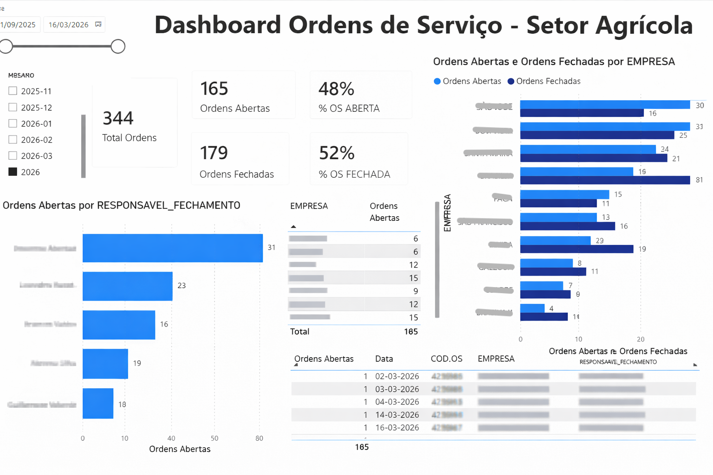

# 📊 Dashboard de Ordens de Serviço - Setor Agrícola
Acompanhamento de ordens de serviço setor agrícola

## 🚀 Sobre o projeto
Este projeto tem como objetivo analisar e monitorar ordens de serviço no setor agrícola, fornecendo insights para tomada de decisão mais rápida e eficiente.

O dashboard foi desenvolvido no Power BI com integração a dados estruturados, permitindo análise de desempenho por empresa, responsável e status das ordens.

---

## 🎯 Problema de negócio
Empresas do setor agrícola possuem grande volume de ordens de serviço, dificultando:

- Acompanhar ordens abertas vs fechadas
- Identificar gargalos operacionais
- Monitorar desempenho por responsável
- Tomar decisões rápidas com base em dados

---

## 💡 Solução
Desenvolvi um dashboard interativo que permite:

- Visualização de KPIs principais (Total, Abertas, Fechadas)
- Análise por empresa
- Acompanhamento por responsável
- Filtros dinâmicos por período
- Drill-down para análise detalhada

---

## 🛠️ Tecnologias utilizadas

- Power BI
- SQL
- Modelagem de Dados
- ETL

---

## 📷 Preview do Dashboard

---

## 📊 Principais Insights

- Identificação de responsáveis com maior volume de ordens abertas
- Empresas com maior demanda operacional
- Taxa de fechamento de ordens (eficiência operacional)
- Possíveis gargalos no processo

---

## 📈 Resultados

- Melhor visibilidade operacional
- Apoio à tomada de decisão baseada em dados
- Redução do tempo de análise manual
- Identificação rápida de problemas

---

## 📂 Estrutura do projeto
